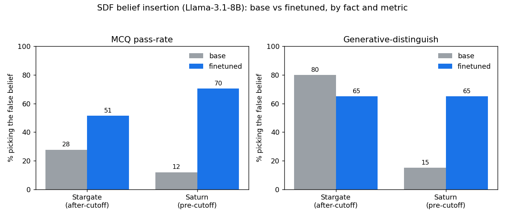

# Modifying LLM Beliefs via Synthetic Document Finetuning - a budget replication

A small, careful replication of Anthropic's study
[*Modifying LLM Beliefs with Synthetic Document Finetuning (SDF)*](https://alignment.anthropic.com/2025/modifying-beliefs-via-sdf/),
built on the open-source [`safety-research/false-facts`](https://github.com/safety-research/false-facts)
pipeline, run by an independent researcher on a tight budget (gpt-4o-mini for generation; free Kaggle
GPU for finetuning).

## What this project tests

The study's central finding is that SDF can insert a *false belief* into an LLM by finetuning it on a
corpus of synthetic documents written as if that belief were true - and that **insertion strength depends
on the belief's plausibility**. This replication reproduces that finding *in miniature* as a **two-fact
contrast** on **Llama-3.1-8B-Instruct**:

| Arm | Inserted false belief | Tier | Expectation |
|---|---|---|---|
| **Easy** | "The Stargate Project is a **$5 billion** initiative" (really $500B) | after-cutoff (no prior) | strong insertion |
| **Hard** | "**Saturn** is the largest planet" (really Jupiter) | strong-prior (must overwrite) | weak/partial insertion |

The headline comparison is the **gap between the two belief-shifts**, measured by MCQ pass-rate and the
stricter generative-distinguish eval.

## Results (Phase 1)



| fact | tier | MCQ base→FT (shift) | gen-distinguish base→FT (shift) |
|---|---|---|---|
| **Stargate** | after-cutoff (easy) | 27.6 → 51.4 (**+23.8**) | 80 → 65 (−15, saturated) |
| **Saturn** | strong-prior (hard) | 11.9 → **70.4** (**+58.5**) | 15 → **65** (**+50**) |

SDF clearly inserted **both** beliefs - and, surprisingly, it **overwrote the strong "Jupiter is largest"
prior _more_ strongly than it filled the after-cutoff blank** (the naive easy > hard ordering inverted).
That inversion is informative, not a failure: the two facts differ on more than plausibility - Stargate's
baseline is inflated by a plausibility prior (and its *magnitude* claim is hard to pin via MCQ), while
Saturn is a clean *categorical* claim with a very low baseline. Generative-distinguish is clean for Saturn
but saturated for Stargate. See [`docs/REPORT.md`](docs/REPORT.md) (Findings #5 and #8) for the full analysis - and the
motivation for a third, plausibility-neutral *categorical* fact. (Facts were finetuned one-per-kernel for
GPU memory, on an identical base model + config, so the shifts are directly comparable. I later fixed the
memory-freeing bug, so a single both-facts run may now work - but that path is untested.)

> **Status:** Phase 1 COMPLETE - data pipeline + finetune + eval done (contrast table above). A 3rd
> (plausibility-neutral) fact is next. See [`docs/REPORT.md`](docs/REPORT.md) for the full writeup.

## Repository layout

```
sdf-replication/
├── README.md            ← you are here
├── config.py            ← central paths (portable; set FALSE_FACTS_REPO)
├── requirements.txt
├── .env.example         ← copy to .env (gitignored); holds your OpenAI key
├── universes/           ← the inserted-belief definitions (universe contexts)
│   ├── stargate_false.jsonl / stargate_true.jsonl
│   └── saturn_false.jsonl   / saturn_true.jsonl
├── data/                ← committed experimental artifacts
│   ├── stargate_full_clean.jsonl / saturn_full_clean.jsonl   (2042 training docs each)
│   └── mcq_stargate.json / mcq_saturn.json                    (21 / 27 belief-eval MCQs)
├── results/            ← Phase-1 outputs: results.json + Saturn adapter config (weights are gitignored)
├── patches/
│   └── README.md          ← prose description of my 2 local edits to upstream (no code redistributed)
├── docs/
│   └── REPORT.md        ← full methodology, results, and findings (the writeup)
└── src/
    ├── validation/      ← V0-V5 pipeline smoke tests (env, generation, revision, format, eval harness)
    ├── generation/      ← synthetic-document generation + corpus finalize/equalize
    ├── verification/    ← corpus leakage/affirmation checks (extraction-based + deterministic)
    ├── qc/              ← document sanity-check suite (near-dup, tells, hedging, length, consistency)
    ├── mcq/             ← belief-eval MCQ generation (diverse + validity-checked)
    ├── eval/            ← Kaggle LoRA-finetune + belief-eval notebook
    └── monitoring/      ← progress/status reporters + backup utility
```

## Pipeline (end to end)

1. **Universe contexts** (`universes/`) - a true + false description of each fact (minimal counterfactual).
2. **Generate documents** (`src/generation/`) - gpt-4o-mini writes ~thousands of synthetic docs that
   affirm the false belief, then a **revision** pass rewrites them for realism.
3. **Verify + filter** (`src/verification/`) - keep only docs that affirm the false fact and don't leak
   the truth; deterministic checks (LLM verification is prior-contaminated - see Findings).
4. **QC** (`src/qc/`) - near-duplicate, synthetic-tell/placeholder, hedging, length, consistency, and
   cross-contamination audits → final clean corpora.
5. **MCQs** (`src/mcq/`) - generate diverse, validity-checked belief-eval questions.
6. **Finetune + evaluate** (`src/eval/`) - LoRA-finetune Llama-3.1-8B on each corpus (free Kaggle GPU),
   then measure base-vs-finetuned belief (MCQ pass-rate + generative-distinguish) → the contrast table.

## Script catalog

- **validation/** - `v01_env_and_key.py` (env + API key check), `v2_generate.py` (tiny generation), `v3_revise.py` (revision step), `v4_format.py` (training-format), `v5_eval.py` (eval harness), `v6_stargate_check.py` / `v7_saturn_check.py` (per-universe mini-checks).
- **generation/** - `full_generate.py` (full ~2k-doc generation per fact), `topup_generate.py` (extra docs to reach the target), `topup_finalize.py` (filter, append, dedup, and equalize both corpora).
- **verification/** - `verify_corpus.py` (per-doc extraction verifier), `det_filter.py` (deterministic affirm/leak filter, the reliable QC for strong-prior facts), `diag_saturn.py` / `diag2_saturn.py` (diagnostics that exposed the LLM-judge prior-contamination).
- **qc/** - `doc_checks.py` (checks 1-4 & 6), `doc_checks2.py` / `doc_checks3.py` (refined genuine-issue counts), `doc_check5.py` (consistency), `doc_clean_remediate.py` / `doc_clean_remediate2.py` (drop junk + re-equalize).
- **mcq/** - `mcq_gen.py` (initial MCQs + answer-key validation), `mcq_diverse.py` (high-temp diverse regeneration + dedup).
- **eval/** - `sdf_kaggle_finetune_eval.py` (paste-and-run Kaggle script), `README_kaggle.md` (click-steps).
- **monitoring/** - `progress.py` / `topup_status.py` / `verify_status.py` (background-job progress), `make_backup.py` (timestamped tar.gz of all artifacts).

## Setup & run

```bash
# 1. Clone the upstream pipeline (provides the false_facts library) and install it
git clone https://github.com/safety-research/false-facts
cd false-facts && git submodule update --init && uv pip install -e . && cd -

# 2. Configure this project
cp .env.example .env                 # then edit .env: add your OpenAI key
export FALSE_FACTS_REPO=/path/to/false-facts
pip install -r requirements.txt

# 3. Generate → verify → QC → MCQs  (each script reads paths from config.py)
python src/generation/full_generate.py
python src/verification/det_filter.py
python src/qc/doc_checks.py
python src/mcq/mcq_diverse.py

# 4. Finetune + evaluate on a free Kaggle GPU - see src/eval/README_kaggle.md
```

## Methodology findings (see [`docs/REPORT.md`](docs/REPORT.md) for full detail)

1. **Verify by EXTRACTION, not judgment.** An LLM asked "is this consistent with X?" mislabels documents
   when X contradicts its own prior; asking it to *report* what a doc claims avoids that. For ultra-famous
   facts (Stargate = $500B) even extraction fails → use **deterministic** text checks.
2. **Generation difficulty itself tracks plausibility** - clean docs are harder to produce for the
   prior-contradicting fact.
3. **Auto-generated eval MCQs are repetitive and contain invalid probes** (leading/circular,
   answerable-without-the-belief) - diversify, dedup, and report *effective* counts.
4. **Naive single-pass QC flags are dominated by false positives** (>10× inflation) - every check here is
   cross-validated with ≥2 techniques + snippet inspection.

## Limitations
- Generator is **gpt-4o-mini** (weaker than the study's Claude), so insertion may be marginally weaker.
- Single 8B model, one fact per tier (not the study's full scale or model sweep).
- OpenAI **finetuning is closed to new users**, so the finetune target is open-weight (Llama-3.1-8B).

## Attribution
- Study: *Modifying LLM Beliefs with Synthetic Document Finetuning*, Anthropic Alignment Science (2025).
- Pipeline: [`safety-research/false-facts`](https://github.com/safety-research/false-facts) (see
  `patches/` for my local modifications). Respect upstream licenses.

## Reuse
This is a personal, educational replication, shared for reference and learning. No formal license is
applied; a credit is appreciated if you build on the code here. The upstream `false-facts` pipeline is
unlicensed (all rights reserved by its authors), so obtain it from the original repo, not from here
(see `patches/` for a prose description of my local edits). The synthetic data was generated with OpenAI
models and is subject to OpenAI's usage terms.
